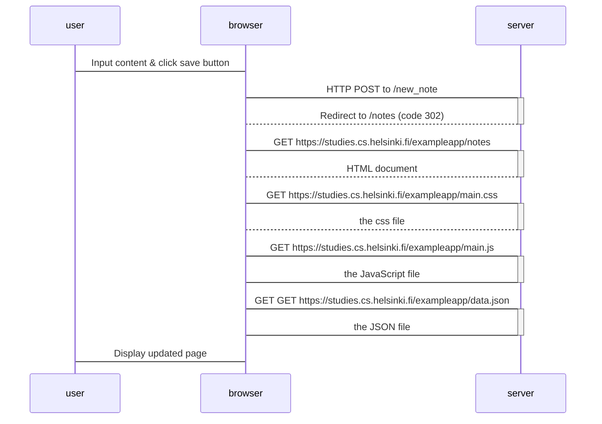

```mermaid
sequenceDiagram
participant user
participant browser
participant server

  user->browser: Input content & click save button

  browser->+server: HTTP POST to /new_note
  server-->-browser: Redirect to /notes (code 302)

  browser->+server: GET https://studies.cs.helsinki.fi/exampleapp/notes
  server-->-browser: HTML document

  browser->+server: GET https://studies.cs.helsinki.fi/exampleapp/main.css
  server-->-browser: the css file

  browser->+server: GET https://studies.cs.helsinki.fi/exampleapp/main.js
  server->-browser: the JavaScript file

  browser->+server: GET GET https://studies.cs.helsinki.fi/exampleapp/data.json
  server->-browser: the JSON file

  browser->user: Display updated page
```