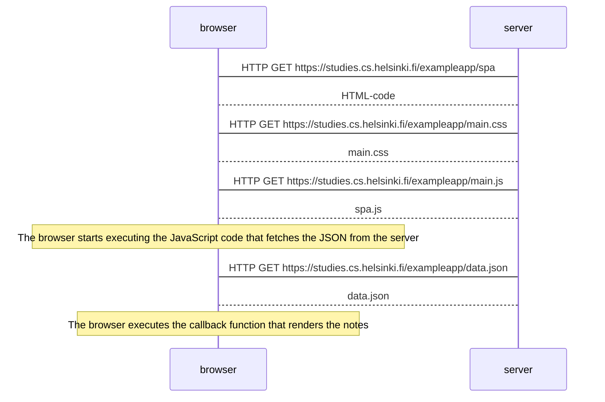

```mermaid
sequenceDiagram
    participant browser
    participant server

    browser->server: HTTP GET https://studies.cs.helsinki.fi/exampleapp/spa
    server-->browser: HTML-code
    browser->server: HTTP GET https://studies.cs.helsinki.fi/exampleapp/main.css
    server-->browser: main.css
    browser->server: HTTP GET https://studies.cs.helsinki.fi/exampleapp/main.js
    server-->browser: spa.js

    Note over browser: The browser starts executing the JavaScript code that fetches the JSON from the server

    browser->server: HTTP GET https://studies.cs.helsinki.fi/exampleapp/data.json
    server-->browser: data.json

    Note over browser:The browser executes the callback function that renders the notes
  
```